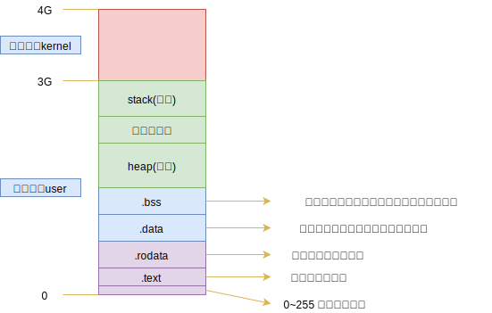
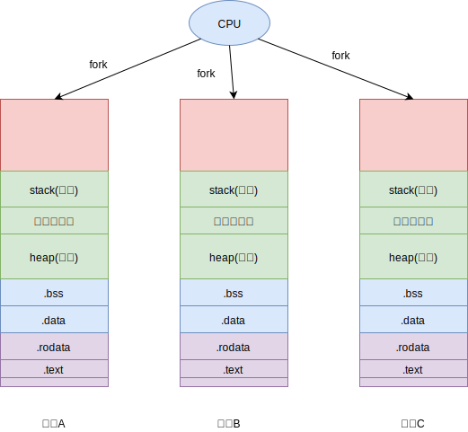
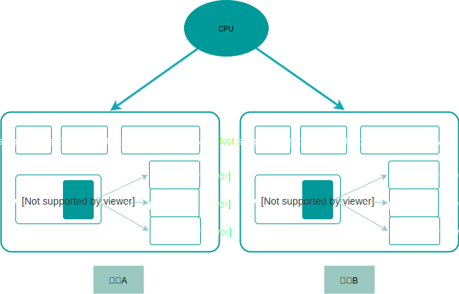

# 02-并发模型-2-多线程

## 一 线程概述

### 1.1 进程与线程创建

操作系统会为每个进程分配一定的内存地址空间，如图所示：



上图所示的是 32 位系统中虚拟内存的分配方式，不同系统分配的虚拟内存是不同的，但是其数据所占区域的比例是相同的：

-   32 位：最大内存地址为 2<sup>32</sup>，这么多的字节数换算为 G 单位，即为 4G。（换算为 1G=1024MB=1024*1024KB=1024*1024\*1024B）
-   64 位：最大内存地址为 2<sup>64</sup>，这么多的字节数换算为 G 单位，数值过大，不便图示

在多进程编程的并发模型中，每次 fork 一个子进程，都代表新创建了一个完整的上述内存地址空间，如图所示：



线程就与进程不同了，一个进程内部可以创建多个线程，如图所示：



### 1.2 理解线程

从创建线程的图示可以看出：线程可以视为某个进程内部的控制流。

> 线程：操作系统基于进程开启的轻量级进程，
> 线程是操作系统最小的调度执行单位（即 cpu 分配时间轮片的对象）

线程不能独立于进程而存在，其生命周期不可能逾越其所属的进程生命周期，与进程不同，线程不存在父子级别关系，同一进程中的任意 2 个线程之间的关系是平等的。  
一个进程内部的线程包括：

-   主线程：必定拥有，因为进程必须有一个控制流持续运行，该线程随着进程的启动而创建
-   其他线程：不一定拥有，由主线程或者其他线程创建（C 语言调用 pthread_create 函数）

综上我们可以得出：

> 线程与进程一样拥有独立的 PCB，但是没有独立的地址空间，即线程之间共享了地址空间。这样也让线程之间无需 IPC，直接就能通信！！

进程的大多数资源会被其内部的线程所共享，如：代码段、数据段、堆、信号处理函数、当前进程持有的文件描述符等。所以，同一进程中的多个线程运行的一定是同一个程序，只不过具体的控制流和执行的函数可能不同。也正因如此，同一进程内的多线程共享数据变得很轻松，创建新线程也无需再复制资源了。

虽然线程带来了通信的便利，如果同一空间的中多个线程同时去使用同一个数据，就会造成资源竞争问题，这是计算机编程中最复杂的问题之一。

### 1.3 线程标识

每个线程也有属于自己的 ID，称为 TID，只在其所属的进程范围内唯一。

注意：Linux 中的线程 ID 在系统范围内也是唯一的，且线程不存在后，该 ID 可被其他线程复用。

### 1.4 线程调度

线程之间不存在类似进程的树形关系，任何线程都可以对同一进程的其他线程进行有限的管理。

调度器会把事件划分为极小的时间片，并把这些时间片分配给不同的线程，以使众多线程都有机会在 CPU 上运行，也造成了我们多线程被并行运行的幻觉。

### 1.5 线程的应用

对于多线程并发模型的 web 服务器，如果需要同时处理多个请求，当请求到达时，web 服务器会创建一个线程，或者从线程池中获取一个线程，然后将请求来委派给线程来实现并发。

## 二 线程同步

### 2.0 同步的概念

由于多进程、多线程、协程等都可以抢占共享资源，我们就必须保证他们访问时数据的一致性，这种保持数据内容一致的机制称为**同步**。

多个控制流操作一个共享资源的情况，都需要同步！！

一般情况下，只要让共享区域的操作串行化，就可以实现同步，这种实现了串行化的共享区域称为**临界区**。

这里主要研究线程同步的方式，包括：

-   互斥量
-   条件变量
-   原子操作

### 2.1 互斥量

> 互斥（mutex）：在同一时刻，只允许一个线程处于临界区内。

线程将对象锁定后，才能进入临界区，否则线程就会阻塞，这个对象我们称之为互斥对象或者互斥量。

由此可知，互斥量有已锁定、未锁定两种状态，且一旦被锁，则不能再次锁定，只有解锁后才能再次锁定（即不允许别的线程二次加锁）。多个线程为了能够访问临界区，将会争夺锁的所有权。

线程在离开临界区的时候，必须对互斥量进行解锁，此时其他想进入该临界区的线程将会被唤醒再次争夺锁。

如果不同的临界区中包含了对同一个共享资源的同一种操作，此时会产生死锁。

解决死锁的办法有两种：

-   试锁定-回退：操作系统的线程库中提供了该功能。在执行一个代码块时，如果需要先后锁定多个互斥量，成功锁定其中一个互斥量后应该使用试锁定的方法来锁定后续互斥量，如果后续任一互斥量锁定失败，则解锁刚才被锁的互斥量，重新进行争夺锁尝试。
-   注意：多个互斥量被成功加锁后，解锁顺序和加锁顺序相反，这样可以减少回退次数。
-   固定顺序锁定：举例，线程 A 和线程 B 总是先锁定互斥量 1，再锁定互斥量 2，那么就不会产生死锁。

第一种方案更加有效，但是程序变得复杂了，后一种方法简单实用，但是因为存在固定顺序，降低了程序的灵活性。

### 2.2 条件变量

互斥量有时候也不能完美解决问题，比如最常见的生产消费模型中：

```
数据队列：具备一定大小的空间，用于存储生产的数据
生产者线程：向数据队列不断的添加数据
消费者线程：向数据队列不断的取出数据
```

由于生产者线程和消费者线程都会对数据队列进行并发访问，那么我们肯定会为数据队列进行加锁操作，以实现同步。

此时如果生产者线程获得互斥量，发现数据队列已满，无法添加新数据，生产者线程就可能在临界区一直等待，直到有空闲区间。这种做法明显是错误的，因为该线程一直阻塞在临界区，直接影响了其他消费者线程的使用！生产者线程应该在发现没有空闲区间时直接解锁退出。

同样的，消费者线程在获取锁后，如果发现数据队列为空，则也会一直等待，这都是不合理的，应该发现为空后直接解锁。

引入条件变量，与互斥量配合使用，可以解决上述问题。

> 条件变量：条件变量一般与互斥量组合使用，在对应的共享数据状态发生变化时，通知其他被阻塞线程。

条件变量有三种操作：

-   等待通知（wait）：如果当前数据状态不满足条件，则解锁与该条件变量绑定在一起的互斥量，然后阻塞当前线程，直到收到该条件变量发来的通知
-   单发通知（signal）：让条件变量向至少一个正在等待它通知的线程发送通知，以表示共享数据状态发生了改变
-   广播通知（broadcast）：给等待通知的所有线程发送通知

### 2.3 原子操作

原子操作的执行过程不能被中断，因为此时 CPU 不会去执行其他对该值进行的操作，这也能有效的解决一部分竞争问题。
